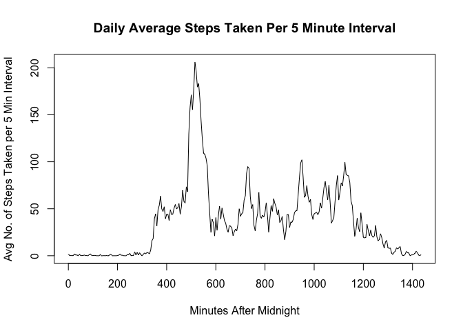

# Reproducible Research: Peer Assessment 1
reneej1729  
April 7, 2015  


## Loading and preprocessing the data
The code below will load all of the necessary packages we need throughout this document, as well as reading the data, and manipulating it for easier use. Notice that we add an additional column to the data, called minutes, that calculates the number of minutes passed since midnight from the column titled interval, that lists times in 24 hour clock notation with no colon.

```r
library(dplyr)
library(lattice)
unzip("activity.zip")
data <- read.csv("activity.csv")
data$date <- as.Date(data$date)
data <- mutate(data, minutes = floor(interval/100)*60 + interval%%100)
```
We will explore what happens by day, so we will need a daily data set, which holds the sum of steps taken on each day.

```r
daily <- tapply(data$steps, data$date, sum, na.rm = TRUE)
```
We will also be interested in what happens at each time interval throughout the day, so we will need an interval data set, which holds the average number of steps taken over each time interval per day. We will use our minutes variable to do this.

```r
interval <- tapply(data$steps, data$minutes, mean, na.rm = TRUE)
```

## What is mean total number of steps taken per day?

```r
totalSteps <- sum(data$steps, na.rm = TRUE)
```
Over the course of the two month period, a total of 570608 were taken by our anonymous user.  

Consider the histogram below, which looks at our daily data.


```r
hist(daily, breaks = 10, main = "Histogram of Total Number of Steps Taken per Day", xlab = "Total Number of Steps Taken per Day")
```

 


```r
meanS <- round(mean(daily))
medS <- median(daily)
```

The mean of this daily data is 9354 and the median is 10395 which seems consistent with what we see in the histogram.  


## What is the average daily activity pattern?
Let us look at a line plot of what is happening on average at each five minute interval throughout the day.


```r
plot(names(interval), interval, type = "l", main = "Daily Average Steps Taken Per 5 Minute Interval", xlab = "Minutes After Midnight", ylab = "Avg No. of Steps Taken per 5 Min Interval")
```

 

The data shows a peak after the 500th minute after midnight. We can find it exactly by executing the following code:

```r
maxI <- round(max(interval))
minutes <- names(interval[grep(max(interval), interval)])
```

So the maximum average number of steps taken in a given five minute interval is 206 and it happens during the interval containing the 515th minute after midnight.  


## Imputing missing values
Let us find how many missing values are in our data set. 

```r
nas <- sum(is.na(data$steps))
```
There are 2304 NAs in our data set. If we replace the NAs with 0, we will not change the total number of steps taken each day or the total number of steps taken over the two month period. We can make this change with the following code and also, look at the histogram of the resulting data:

```r
data0 <- data
data0$steps[is.na(data$steps)] <- 0
daily0 <- tapply(data0$steps, data$date, sum)
mean0 <- round(mean(daily0))
median0 <- median(daily)
hist(daily0, breaks = 10, main = "Histogram of Total Number of Steps Taken per Day", xlab = "Total Number of Steps Taken per Day")
```

 

Where the new mean is 9354 and the new median is 10395, which are the same values we found in the original data set, which makes sense if we are not changing the number of steps taken per day from our previous data set.

## Are there differences in activity patterns between weekdays and weekends?
Let us look at a line graph of these data to answer this question.

```r
weekday <- c("Monday", "Tuesday", "Wednesday", "Thursday", "Friday")
weekend <- c("Saturday", "Sunday")
data0 <- mutate(data0, day = weekdays(data0$date))
data0$day[data0$day %in% weekend] <- "Weekend"
data0$day[data0$day %in% weekday] <- "Weekday"
data0$day <- as.factor(data0$day)
days <- summarize(group_by(data0, day, interval), m = mean(steps))
xyplot(m ~ interval|day, data = days, layout = c(1,2), type = "l", xlab = "Minutes After Midnight", ylab = "Avg No. of Steps Taken per 5 Min Interval", main ="Daily Average Steps Taken Per 5 Minute Interval: Weekend vs Weekday")
```

 

These graphs seem to show that there is less steps in the 500-800 minute interval, but that in the 1000-2000 the user takes more steps in most five minute intervals.
